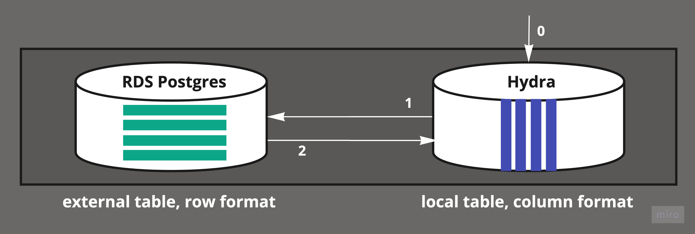

# 📡 External Tables

External Tables are data that lives in databases outside Hydra. You can use External Tables to select, join, and insert data to and from your data warehouse. For example, in the image below, we see Hydra tables represented as “local” and RDS tables as “external.” Data in RDS is being fetched and returned through Hydra.

<figure><figcaption><p>External Tables can be used to query and combine data from multiple data sources.</p></figcaption></figure>

## Use Cases

Data warehouses are referred to as an organization’s source of truth because they aggregate data from different sources into a single, central data store to support data analysis. Traditionally, organizations configure data pipelines to copy data from multiple sources into the warehouse. While this approach works well for immutable data like analytics, rapidly changing data quickly becomes out of date. Constantly refreshing this data is expensive, slow, and restrictive.

External tables address the following problems:

* Data copying grows storage and pipeline costs.
* The warehouse’s data recency is limited to the data copy rate.
* Impossible to run ad-hoc queries without copying relevant tables to the warehouse.

With External Tables, queries execute on source databases directly, which greatly reduces frictions and costs outlined above. In our first example, we’ll show how to query RDS tables from Hydra.

## Postgres External Tables

Postgres External Tables are implemented using `postgres_fdw`. To set up a Postgres External Table from `psql`, run the following SQL, replacing `...` with your server's information.

```sql
CREATE EXTENSION postgres_fdw;

CREATE SERVER remote_pg_server FOREIGN DATA WRAPPER postgres_fdw OPTIONS (host '...', port '...', dbname '...');

CREATE USER MAPPING FOR CURRENT_USER SERVER remote_pg_server OPTIONS (user '...', password '...');
```

You can now create foreign tables from your remote Postgres database.
You can [import all of your remote tables](https://www.postgresql.org/docs/current/sql-importforeignschema.html) at once as follows:

```sql
CREATE SCHEMA remote_pg;

IMPORT FOREIGN SCHEMA public FROM SERVER remote_pg_server INTO remote_pg;
```

💡 You can name the server and schema as you see fit.

You can now query your remote database from Hydra, including:

* Using `JOIN` between data in Hydra and in your remote database
* Inserting, updating, or deleting data

### Bi-directional connection

On many Postgres providers, you can also set up this connection in the other direction. This allows you to access your Hydra data warehouse from your other databases. You may need to contact your provider to get the necessary permissions.

## MySQL External Tables

MySQL External Tables are implemented using [`mysql_fdw`](https://github.com/EnterpriseDB/mysql_fdw).
To set up a MySQL External Table from `psql`, run the following SQL, replacing `...` with your server's information.

```sql
CREATE EXTENSION mysql_fdw;

CREATE SERVER remote_mysql_server FOREIGN DATA WRAPPER mysql_fdw OPTIONS (host '...', port '...');

CREATE USER MAPPING FOR CURRENT_USER SERVER remote_mysql_server OPTIONS (username '...', password '...');
```

You can now create foreign tables from your remote MySQL database.
Assuming your remote MySQL database's name is `mysql`, you can [import all of your remote tables](https://www.postgresql.org/docs/current/sql-importforeignschema.html) at once as follows:

```sql
CREATE SCHEMA remote_mysql;

IMPORT FOREIGN SCHEMA mysql FROM SERVER remote_mysql_server INTO remote_mysql;
```

## S3 CSV External Tables

You can run queries against CSV files stored on Amazon S3.
S3 CSV External Tables are implemented using [`s3csv_fdw`](https://github.com/eligoenergy/s3csv_fdw).
To create a S3 CSV External Table, create a `data.csv` file with the following content:

```csv
1,o@example.com
2,jd@example.com
3,joe@example.com
```

Upload the file to S3 and create a `multicorn` S3 CSV foreign table, replacing `...` with your AWS credentials and S3 bucket name:

```sql
CREATE EXTENSION multicorn;
CREATE SERVER multicorn_s3 FOREIGN DATA WRAPPER multicorn
  OPTIONS (
    wrapper 's3fdw.s3fdw.S3Fdw'
  );
create foreign table users_csv (
  id int,
  email text
) server multicorn_s3 options (
  aws_access_key '...',
  aws_secret_key '...',
  bucket '...',
  filename 'data.csv'
);
```

## S3 Parquet External Tables

You can run queries against [Apache Parquet files](https://parquet.apache.org/) stored on Amazon S3.
S3 Parquet External Tables are implemented using [`parquet_s3_fdw`](https://github.com/hydradatabase/parquet_s3_fdw).
As an example, we are using the same data from [here](https://github.com/Teradata/kylo/tree/master/samples/sample-data/parquet).

The column details are as followed:

```
column#  column_name        hive_datatype
=====================================================
1        registration_dttm  timestamp
2        id                 int
3        first_name         string
4        last_name          string
5        email              string
6        gender             string
7        ip_address         string
8        cc                 string
9        country            string
10       birthdate          string
11       salary             double
12       title              string
13       comments           string
```

Upload the parquet files to a S3 bucket folder called `sample-data`, and create a S3 Parquet foreign table, replacing `...` with your AWS credentials, region, and S3 bucket name:

```sql
CREATE EXTENSION parquet_s3_fdw;

CREATE SERVER parquet_s3_srv FOREIGN DATA WRAPPER parquet_s3_fdw OPTIONS (aws_region '...');

CREATE USER MAPPING FOR CURRENT_USER SERVER parquet_s3_srv OPTIONS (user '...', password '...');

CREATE FOREIGN TABLE userdata (
    registration_dttm timestamp,
    id int,
    first_name text,
    last_name text,
    email text,
    gender text,
    ip_address text,
    cc text,
    country text,
    birthdate text,
    salary FLOAT8,
    title text,
    comments text
)
SERVER parquet_s3_srv
OPTIONS (
    dirname 's3://.../sample-data'
);
```
You can now read data from the Parquet file using `SELECT ... FROM userdata`. Note that every query will read the data again, incurring charges on your AWS account. For better performance and avoiding ongoing charges, we recommend caching the data locally in Hydra by insert it into a table or using a materialized view.

## Google Spreadsheet External Tables

You can run run queries against Google Spreadsheets.
Google Spreadsheet External Tables are implemented using [`gspreadsheet_fdw`](https://github.com/hydradatabase/gspreadsheet_fdw).
To create a Google Spreadsheet External Table, create a Google Spreadsheet with some data:

* Put column names in the first row: untitled columns will not be read
* A blank row terminates the table (data below won't be read)
* Put it in the first (and only) worksheet

Get the spreadsheet ID from the HTTP URL. The ID is a 44-character string matching regexp `[A-Za-z0-9_]{44}`.
It lives between the `/spreadsheets/d/` and possible trailing `/edit/blah` in the URL of your Google Spreadsheet.

Create a Google Service Account and enable Google Sheets API access by following [this guide](https://docs.gspread.org/en/latest/oauth2.html).
Share your Google spreadsheet with the Google Service Account email that is in the format of `...@...gserviceaccount.com`.

Create a foreign table, replacing `...` with your Google Spreadsheet ID and Google Service Account credentials in JSON format:

```sql
CREATE EXTENSION multicorn;

CREATE SERVER multicorn_gspreadsheet FOREIGN DATA WRAPPER multicorn
  OPTIONS (
    wrapper 'gspreadsheet_fdw.GspreadsheetFdw'
  );

CREATE FOREIGN TABLE test_spreadsheet (
  id character varying,
  name   character varying
) server multicorn_gspreadsheet options(
  gskey '...',
  serviceaccount '...'
);
```

## Other External Table Engines

Hydra is working on providing connections to other data sources in the near future. If you have a request, please reach out to us via our support channel.
