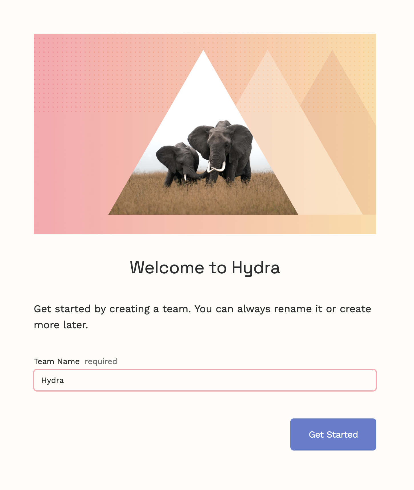
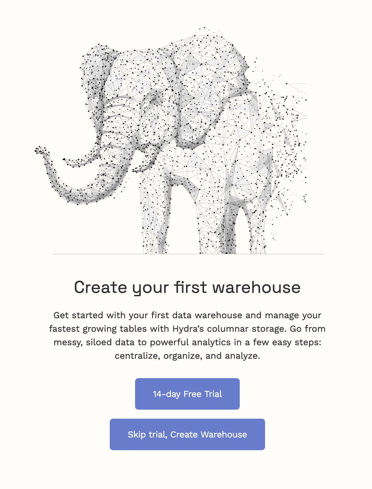
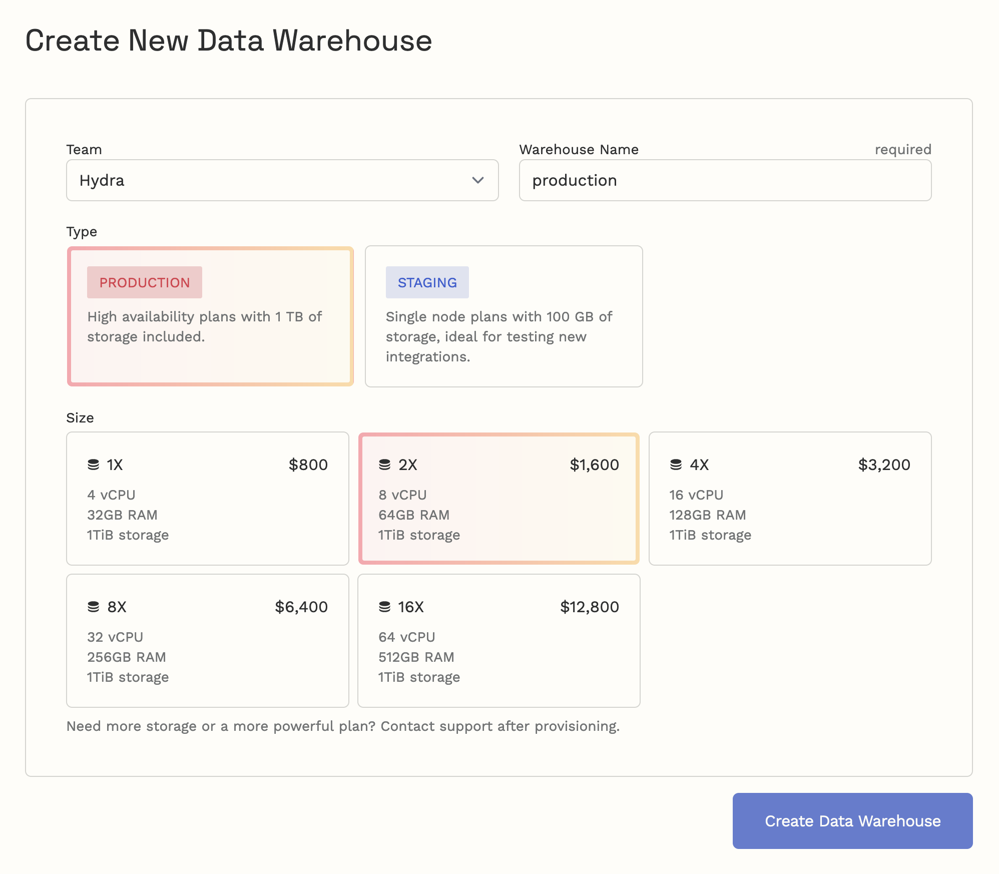
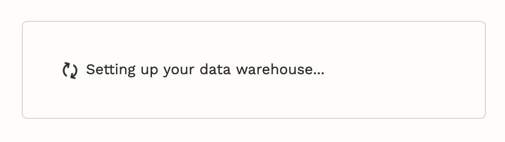
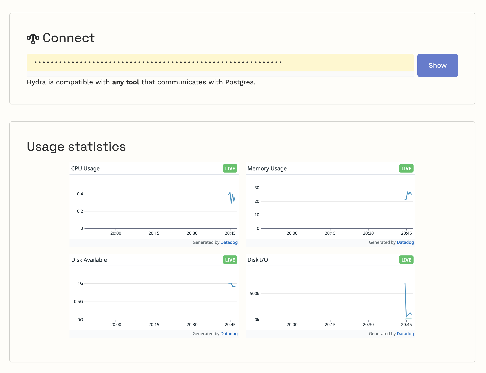

# Setup Guide

## Signing Up

First, a bit of bookkeeping.

1. Sign up with either email address and password or with Google Auth.
2. Confirm you have read our [Terms of Service](https://hydras.io/legal/tos).

## Name Your Team

In Hydra, every account is part of a team. In this step, you will name your team. We recommend using your company name or your team's name within your company.

💡 If you accepted a team invite from a teammate, you will not see this step.

## Creating Your Data Warehouse

Welcome to Hydra! You will now have two options: request a demo or proceed with a data warehouse of your choice. If you request a demo, we will reach out to you to schedule a call to verify your request. If you have already talked to a Hydra staff member, we will approve your request promptly. Your demo will appear on this page once it has been provisioned.

Alternatively, you can choose to create a Hydra data warehouse immediately by clicking "Skip trial, Create Data Warehouse".

### Choosing a Plan

You can create a Hydra data warehouse by providing a name, tier, and plan.

1. The name you choose is purely for your own use and is only reflected in the Hydra dashboard, and can be changed later.
2. First pick your desired tier. All Production plans have HA, while Staging plans do not. We recommend Production if availability is important for your use case.
3. Now pick your plan size. A 1X plan is usually the best place to start! Hydra can always increase your plan later.

### Paying for Hydra

Your Hydra subscription will be fully managed by Stripe. There's no upfront billing and you can cancel anytime -- we pro-rate all charges to the nearest day.

### Ready... Set... Hydra!

Your Hydra data warehouse will take about 5 minutes to be ready. Take a break and rehydrate! If your Hydra is still not available after 15 minutes, something has gone wrong! Please contact support.

Once ready, the page will show your connection details and the very first metrics for your new data warehouse.

## Connecting, Importing Data, and Running Queries

You are now ready to begin importing data into your data warehouse. Use the "Show" button to obtain the credentials to your data warehouse. If you're familiar with the CLI and `psql`, you can copy-paste the command directly to your terminal. With Hydra, you can use any Postgres adapter or any tools with Postgres compatibility to connect and run queries.

The journey begins here! Here's some possible next steps:

* [Loading sample data](loading-sample-data.md)
* [Load data from an existing Postgres database](../centralize-data/load/from-postgres.md)
* [Set up an ETL tool](../centralize-data/stream/etl-tools.md)
* [Import your SaaS data to Hydra using Segment](../centralize-data/stream/segment.md)
