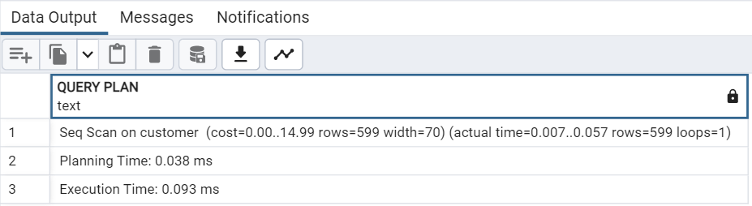
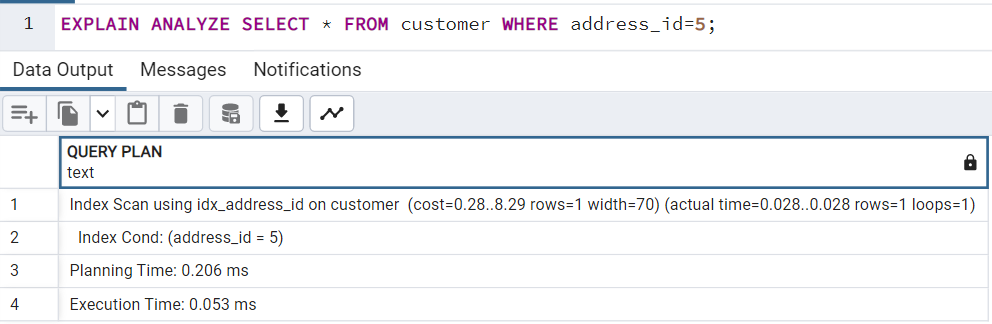
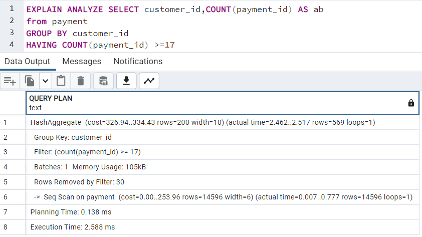
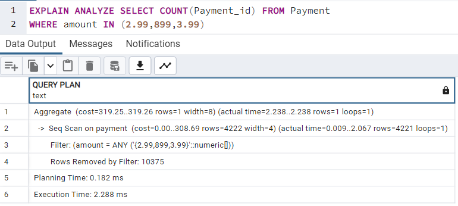

# Query Optimization + Diagnostic Tooling

## Scope

Query optimization involves identifying the most efficient way to execute a query, considering the structure of the database and available indexes. The Postgres query optimizer can perform this task. Proper optimization techniques can help reduce costs and enhance environmental sustainability by using resources more efficiently.

## Postgres Query Planner

PostgreSQL generates a query plan for each query it receives, and the EXPLAIN command allows one to view these plans. The EXPLAIN ANALYZE command can be used to evaluate the accuracy of these plans by viewing the actual performance of each node in the plan.

For example:

```sql
EXPLAIN ANALYZE SELECT * FROM customer;
```

The execution plan of this query is:



## Postgres Query Optimization and Performance Tuning Methods

In this section, you will learn a few optimization techniques along with examples and query execution plans.

### Use of Indexes

An index serves as an additional access structure that enables the rapid location and retrieval of specific data. In the absence of an index, a query would need to search the entire table to find the desired information. By indexing columns commonly used in WHERE or JOIN clauses, PostgreSQL can swiftly locate the desired data.

For instance, the following picture depicts the query execution plan without any indexes.


The execution plan displayed in this image depicts the impact of adding an index on the address\_id column. The addition of the index has resulted in a noticeable improvement in both Planning Time and Execution Time.



### Optimize SELECT Clause

Efficiency issues in queries can be addressed by using specific column names instead of the `*` argument in SELECT statements. Additionally, it is important to execute the HAVING clause after filtering the data with the SELECT statement, as SELECT acts as a filter. To illustrate, replacing `*` with `payment_id` in GROUP BY can improve the query performance. You can see the change in execution plans in both the queries.




While the performance difference is not significant in this example, avoiding use of `*` can often greatly enhance performance when using columnar tables.

### Filtering Rows with Subqueries and Indexes

Filtering data before performing complex operations like GROUP BY or JOIN can enhance query performance by minimizing the amount of data that needs to be processed. Utilizing subqueries or other techniques to filter data is often effective in reducing query execution time and improving database efficiency.


### WHERE Clause

To optimize the `WHERE` clause, we can use `OR` instead of `IN` when there is no index on the filtering column. The `IN` statement matches a column value to a list of values, and technically, it should execute faster than `OR`. However, in some cases, using `OR` instead of `IN` may not improve performance significantly, but it is a way to test if the query can possibly run faster.




### Optimize Joins

To enhance query performance, optimizing joins is essential as they are expensive operations. Substituting joins with subqueries whenever possible is one way to optimize them. Additionally, using the JOIN ON syntax instead of the WHERE clause can help the optimizer produce better execution plans. Filtering records of large tables before joining them with other tables can lead to substantial performance improvements.

These are some additional factors that should be taken into consideration when designing a Postgres query for improved performance:

* Temporary tables can slow down execution but can also avoid the need for ORDER BY operations.
* Some operations may prevent the query from using indexes, so it's important to understand these peculiarities.
* The order of tables in the FROM statement can affect JOIN ordering, particularly when joining more than five tables.
* Index-only scans are faster than full table scans, but index access can be slower when query selectivity is high.
* Views can result in inefficient queries.
* Use DISTINCT only when necessary.
* Minimize the use of subqueries, especially correlated subqueries.
* Long queries are not helped by indexes, but instead can be optimized by minimizing the number of full table scans and reducing the result size as soon as possible.
* Materialized views are useful for speeding up execution time if having fully up-to-date data is not a priority for the query.

## Conclusion

To sum up, enhancing the performance and reducing expenses relies on the optimization of Postgres queries. The use of diagnostic tools such as EXPLAIN and EXPLAIN ANALYZE can assist in identifying likely problems. By utilizing methods like index utilization, column filtering, and optimizing joins, one can enhance query performance greatly. When designing queries for optimal performance, it's crucial to consider different factors like query selectivity, table ordering, and the usage of temporary tables and views.
