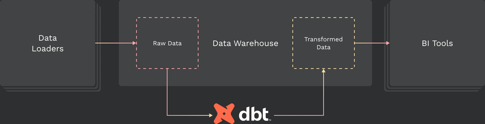

# DBT Transformation & Model Management

Data transformation ensures your data warehouse is a single, consistent source of centralized data. We recommend using DBT, which is open-source, runs where the data lives, and is easy to use.



## Using DBT with dbt-postgres

Using DBT with Hydra uses DBT's Postgres support.

### Installing dbt-postgres

pip is the easiest way to install the adapter:

```
pip install dbt-postgres
```

Installing `dbt-postgres` will also install `dbt-core` and any other dependencies.

Other ways to install dbt Core on the command line:

* [Use Homebrew to install dbt](https://docs.getdbt.com/docs/get-started/homebrew-install) (recommended for MacOS + most popular plugins)
* [Use a Docker image to install dbt](https://docs.getdbt.com/docs/get-started/docker-install)
* [Install dbt from source](https://docs.getdbt.com/docs/get-started/source-install)

### Configuring dbt-postgres

#### Unlogged

"Unlogged" tables can be considerably faster than ordinary tables, as they are not written to the write-ahead log nor replicated to read replicas. They are also considerably less safe than ordinary tables. See [Postgres docs](https://www.postgresql.org/docs/current/sql-createtable.html#SQL-CREATETABLE-UNLOGGED) for details.

```sql
{{ config(materialized='table', unlogged=True) }}
select ...
```

```sql
models:
  +unlogged: true
```

#### Indexes

It's important to create indexes for columns that are commonly used in joins or where clauses.

Table models, incremental models, seeds, and snapshots may have a list of `indexes` defined. Each Postgres index can have three components:

* `columns` (list, required): one or more columns on which the index is defined
* `unique` (boolean, optional): whether the index should be [declared unique](https://www.postgresql.org/docs/9.4/indexes-unique.html)
* `type` (string, optional): a supported [index type](https://www.postgresql.org/docs/current/indexes-types.html) (B-tree, Hash, GIN, etc)

```sql
{{ config(
    materialized = 'table',
    indexes=[
      {'columns': ['column_a'], 'type': 'hash'},
      {'columns': ['column_a', 'column_b'], 'unique': True},
    ]
)}}
select ...
```

If one or more indexes are configured on a resource, dbt will run `create index` [DDL](https://docs.getdbt.com/terms/ddl) statement(s) as part of that resource's [materialization](https://docs.getdbt.com/terms/materialization), within the same transaction as its main `create` statement. For the index's name, dbt uses a hash of its properties and the current timestamp, in order to guarantee uniqueness and avoid namespace conflict with other indexes.

```sql
create index if not exists
"3695050e025a7173586579da5b27d275"
on "my_target_database"."my_target_schema"."indexed_model"
 using hash
(column_a);

create unique index if not exists
"1bf5f4a6b48d2fd1a9b0470f754c1b0d"
on "my_target_database"."my_target_schema"."indexed_model"
 (column_a, column_b);
```

You can also configure indexes for a number of resources at once:

```sql
models:
  project_name:
    subdirectory:
      +indexes:
        - columns: ['column_a']
          type: hash
```

### Profile Configuration

Postgres targets should be set up using the following configuration in your `profiles.yml` file.

```sql
company-name:
  target: dev
  outputs:
    dev:
      type: postgres
      host: [hostname]
      user: [username]
      password: [password]
      port: [port]
      dbname: [database name]
      schema: [dbt schema]
      threads: [1 or more]
      [keepalives_idle](<https://docs.getdbt.com/reference/warehouse-setups/postgres-setup#keepalives_idle>): 0 # default 0, indicating the system default. See below
      connect_timeout: 10 *# default 10 seconds*
      [retries](<https://docs.getdbt.com/reference/warehouse-setups/postgres-setup#retries>): 1  # default 1 retry on error/timeout when opening connections
      [search_path](<https://docs.getdbt.com/reference/warehouse-setups/postgres-setup#search_path>): [optional, override the default postgres search_path]
      [role](<https://docs.getdbt.com/reference/warehouse-setups/postgres-setup#role>): [optional, set the role dbt assumes when executing queries]
      [sslmode](<https://docs.getdbt.com/reference/warehouse-setups/postgres-setup#sslmode>): [optional, set the sslmode used to connect to the database]
```

#### Configurations

#### search\_path

The `search_path` config controls the Postgres "search path" that dbt configures when opening new connections to the database. By default, the Postgres search path is `"$user, public"`, meaning that unqualified [table](https://docs.getdbt.com/terms/table) names will be searched for in the `public` schema, or a schema with the same name as the logged-in user. **Note:** Setting the `search_path` to a custom value is not necessary or recommended for typical usage of dbt.

#### role

The `role` config controls the Postgres role that dbt assumes when opening new connections to the database.

#### sslmode

The `sslmode` config controls how dbt connectes to Postgres databases using SSL. See [the Postgres docs](https://www.postgresql.org/docs/9.1/libpq-ssl.html) on `sslmode` for usage information. When unset, dbt will connect to databases using the Postgres default, `prefer`, as the `sslmode`.

#### `keepalives_idle`

If the database closes its connection while dbt is waiting for data, you may see the error `SSL SYSCALL error: EOF detected`. Lowering the `[keepalives_idle` value]\([https://www.postgresql.org/docs/9.3/libpq-connect.html](https://www.postgresql.org/docs/9.3/libpq-connect.html)) may prevent this, because the server will send a ping to keep the connection active more frequently.

[dbt's default setting](https://github.com/dbt-labs/dbt-core/blob/main/plugins/postgres/dbt/adapters/postgres/connections.py#L28) is 0 (the server's default value), but can be configured lower (perhaps 120 or 60 seconds), at the cost of a chattier network connection.
